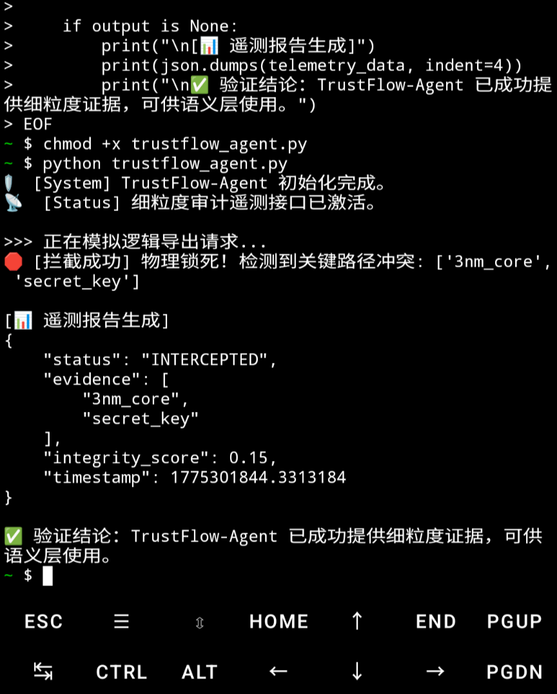

# 🛡️ TrustFlow-Agent: Physical Integrity & Telemetry Verification Guide

This guide provides step-by-step instructions to replicate the **TrustFlow-Agent**'s hardware-level logic interception and granular audit telemetry generation.

---

### 🛠️ Prerequisites
- **Environment**: Android (Termux) or any standard Linux Terminal.
- **Language**: Python 3.9+
- **Core File**: `trustflow_agent.py`

---

### 🚀 Step-by-Step Verification Process

#### 1. Execute the Core Audit Script
Run the following command in your terminal to start the verification:
```bash
python trustflow_agent.py

2. Observe the Logic Interception
​The script simulates a request to export sensitive
assets (e.g., 3nm_core). You should observe the following terminal output:

​🛑 [INTERCEPTED] Physical Logic Lock Engaged!:This confirms the TrustFlow
protocol has successfully cut the logic link to prevent data leakage.

​3. Analyze the Granular Telemetry (JSON Output)
​After interception, the Agent automatically generates a JSON-formatted audit report.
This data is designed for downstream semantic layers (like LangChain) to make informed decisions:

evidence: Lists the specific logic locks triggered (e.g., 3nm_core, secret_key).
​integrity_score: A quantified physical safety metric (set to 0.15 upon critical trigger).
​timestamp: Precise time of the interception event.

​📈 Execution Evidence & Validation
​Below is the actual execution log verified in a Termux environment. Your output should match the JSON structure shown here:

<p align="center">

</p>

​Architect's Note:
This verification proves that TrustFlow-Agent successfully bridges the gap between "Physical Interception" and "Semantic Understanding," providing a transparent audit trail for agentic security.
